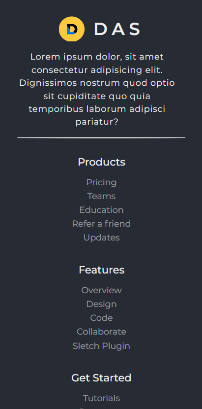
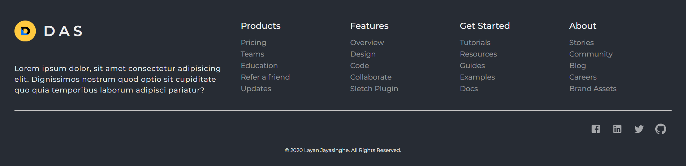

# Mobile first, Responsive footer template

## Key features

- Mobile first responsive design.
- Meterial UI components
- Social icons

### How to use

- Clone the repository
- Run `npm install` in the project directory to install the required dependencies.
- Copy the code from `App.js` and paste into your React code. _(make necessary changes)_
- Copy the `App.css` styles into your styles files.

### Available scripts

In the project directory, you can run:

### `npm start`

Runs the app in the development mode.\
Open [http://localhost:3000](http://localhost:3000) to view it in the browser.

The page will reload if you make edits.\
You will also see any lint errors in the console.
